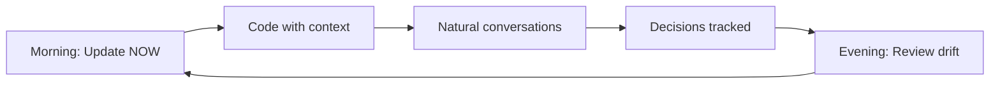

# 🧠 Living Codebase System

A continuous consciousness system that maintains context and learns from your development patterns.

## What's Different?

Unlike command-based systems, this creates a "living" understanding of your codebase:

- **Continuous Context**: Never lose track of what you're doing
- **Natural Language**: Talk to Claude like a colleague
- **Pattern Learning**: Gets smarter about your habits
- **Drift Detection**: Warns when deviating from vision
- **Decision Memory**: Remembers and learns from choices

## Quick Start

1. Run setup in your project:
   ```bash
   cd your-project
   ~/claude-productivity-suite/living-codebase/setup-living-codebase.sh
   ```

2. Edit your context:
   ```bash
   vim .claude-mind/now.md
   ```

3. Start Claude conversations with:
   ```
   "Check .claude-mind/now.md for my current context"
   ```

## How It Works

### The .claude-mind Directory
```
.claude-mind/
├── now.md                    # Current context (update daily)
├── consciousness/
│   ├── intent-map.md        # Your vision
│   └── decisions/           # Decision history
├── memory/                  # Pattern learning
└── pulse/                   # Real-time metrics
```

### Natural Conversations

Instead of commands:
- ❌ `/analyze-codebase`
- ✅ "This is feeling messy"

Instead of specs:
- ❌ `/create-spec auth-flow`
- ✅ "I'm thinking about magic links vs passwords"

## Integration with Claude Productivity Suite

This system **complements** the command-based approach:

1. **Use commands** for discrete actions (build, test, deploy)
2. **Use consciousness** for continuous guidance and context
3. **They work together** - commands can check consciousness state

## Key Components

- **NOW File**: Your current state and focus
- **Intent Map**: What you're building and why
- **Drift Monitor**: Tracks deviation from vision
- **Decision Tracker**: Learns from your choices
- **Natural Interface**: Conversational interaction

## Daily Workflow



## Learn More

See the full documentation in the `docs/` directory.
