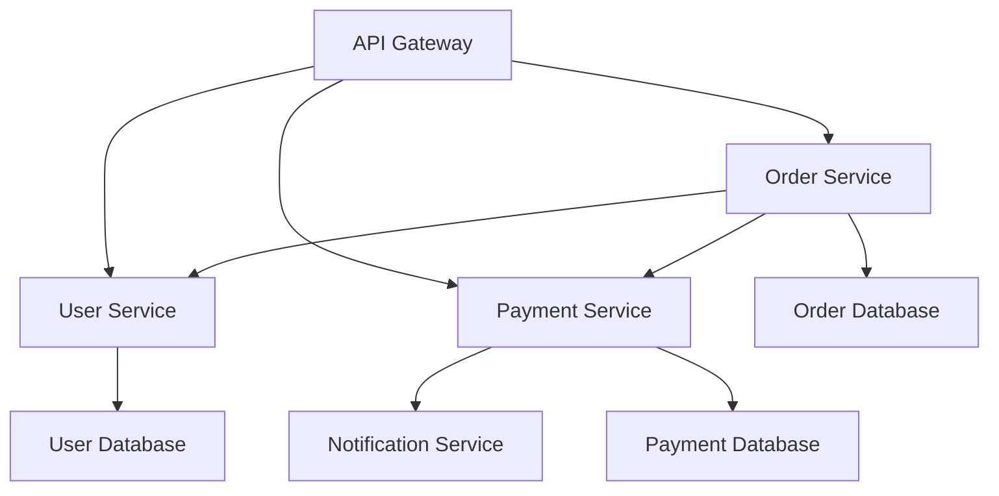

# How to Use Claude for Technical Workflows & Code Documentation

## Table of Contents
1. [Introduction: Revolutionizing Development with Claude Code](#introduction)
2. [Learning Objectives](#objectives)
3. [Success Metrics & Professional Benchmarks](#benchmarks)
4. [Key Concepts & Terminology](#concepts)
5. [Comprehensive Walkthrough: Claude Code Mastery](#walkthrough)
6. [Real-World Case Studies](#casestudies)
7. [Production-Ready Prompts & Templates](#templates)
8. [Practical Exercises & Knowledge Checks](#exercises)
9. [Troubleshooting & FAQs](#troubleshooting)
10. [Integration & Workflow](#integration)
11. [Advanced Topics & Future Trends](#advanced)
12. [Resources & Further Reading](#resources)
13. [Glossary of Terms](#glossary)
14. [Skills Assessment Framework](#assessment)
15. [Mastery Project](#project)

---

## 1. Introduction: Revolutionizing Development with Claude Code {#introduction}

Welcome to the future of software development! In this comprehensive lesson, you'll discover how Claude Code is transforming the way developers work, turning complex coding challenges into collaborative conversations with an AI that truly understands your codebase.

Imagine having a brilliant coding partner who never gets tired, never forgets context, and can instantly understand your entire project structure. That's exactly what Claude Code offers – an agentic coding experience that goes far beyond simple code completion to become your intelligent development collaborator.

**Why This Matters Now**

The software development landscape is evolving rapidly. Traditional development approaches that rely solely on manual coding are becoming increasingly inefficient as projects grow in complexity. Claude Code represents a paradigm shift toward agentic development, where AI doesn't just assist but actively participates in the development process.

**What Makes This Lesson Special**

This isn't just another tutorial about AI coding tools. You'll learn to harness Claude Code's unique agentic capabilities to transform your entire development workflow. From understanding complex codebases to generating comprehensive documentation, you'll master techniques that can dramatically accelerate your development velocity while maintaining the highest quality standards.

**Your Journey Ahead**

By the end of this lesson, you'll have transformed from a traditional developer into an AI-augmented development professional. You'll understand not just how to use Claude Code, but how to think differently about development itself – moving from writing every line of code manually to orchestrating intelligent systems that can understand, plan, and execute complex development tasks.

---

## 2. Learning Objectives {#objectives}

By the end of this lesson, you will confidently master these essential skills:

**Core Technical Competencies:**
- **Master Claude Code fundamentals** for end-to-end software development workflows, from initial concept to final deployment
- **Automate complex coding tasks** including feature implementation, bug fixing, code refactoring, and performance optimization
- **Generate comprehensive technical documentation** including API references, architectural diagrams, developer guides, and user manuals
- **Integrate Claude seamlessly** with your existing development environment, including IDEs, version control systems, and CI/CD pipelines

**Advanced Development Skills:**
- **Apply agentic coding principles** to solve complex technical challenges using Claude's extended thinking and reasoning capabilities
- **Optimize development workflows** for maximum speed, quality, and efficiency using Claude Code best practices
- **Implement quality assurance processes** that leverage Claude's analytical capabilities for code review and testing
- **Design scalable documentation systems** that automatically maintain accuracy and completeness

**Professional Development Outcomes:**
- **Increase development velocity** by 3-5x while maintaining or improving code quality
- **Reduce documentation debt** through automated generation and maintenance of technical documentation
- **Enhance code review processes** with AI-assisted analysis and suggestions
- **Streamline onboarding** for new team members through comprehensive, up-to-date documentation

---

## 3. Success Metrics & Professional Benchmarks {#benchmarks}

### 3.1 Industry Alignment

This lesson aligns with cutting-edge industry standards and best practices:

**Development Excellence Standards:**
- **DevOps Institute** principles for continuous integration and continuous delivery (CI/CD)
- **Google Engineering Practices** for code quality, testing, and comprehensive documentation
- **Microsoft Secure Development Lifecycle (SDL)** for building secure and reliable software systems
- **IEEE Standards for Software Documentation** for creating clear and maintainable technical documentation

**AI-Assisted Development Frameworks:**
- **Anthropic Claude Code** best practices for agentic coding and intelligent development workflows
- **GitHub Copilot Enterprise** integration patterns for team-based AI development
- **OpenAI Codex** optimization techniques for maximum development efficiency

### 3.2 Professional Benchmarks

**Beginner Level (30-60 days):**
- ✅ Successfully set up and configure Claude Code in development environment
- ✅ Complete basic coding tasks with 80% accuracy using Claude assistance
- ✅ Generate simple technical documentation for existing code modules
- ✅ Understand fundamental agentic coding principles and workflows

**Intermediate Level (60-120 days):**
- ✅ Implement complex features using Claude Code with minimal manual intervention
- ✅ Automate routine development tasks and establish efficient workflows
- ✅ Create comprehensive API documentation and architectural diagrams
- ✅ Successfully integrate Claude Code with team development processes

**Advanced Level (120+ days):**
- ✅ Lead agentic development initiatives within development teams
- ✅ Design and implement custom Claude Code workflows for specific project needs
- ✅ Mentor other developers in advanced Claude Code techniques and best practices
- ✅ Contribute to open-source projects using agentic development methodologies

### 3.3 Measurable Success Indicators

**Development Velocity Metrics:**
- **Feature Implementation Speed**: 3-5x faster completion of new features
- **Bug Resolution Time**: 60-80% reduction in time to identify and fix bugs
- **Code Review Efficiency**: 50% reduction in review cycles through AI-assisted analysis
- **Documentation Coverage**: 90%+ of codebase covered by up-to-date documentation

**Quality Assurance Metrics:**
- **Code Quality Scores**: Consistent improvement in static analysis metrics
- **Test Coverage**: Automated generation of comprehensive test suites
- **Security Compliance**: Enhanced security through AI-assisted vulnerability detection
- **Technical Debt Reduction**: Systematic identification and resolution of code quality issues

---

## 4. Key Concepts & Terminology {#concepts}

### 4.1 Fundamental Concepts

**Agentic Coding**
The revolutionary approach where AI systems don't just assist with coding but actively participate in the development process. Unlike traditional code completion tools, agentic coding involves AI that can understand context, make plans, execute complex tasks, and adapt to changing requirements throughout the development lifecycle.

**Claude Code Architecture**
Claude Code operates as an intelligent terminal-based agent that maintains deep awareness of your entire codebase. It combines natural language understanding with sophisticated code analysis to provide contextually relevant assistance that goes far beyond simple autocomplete functionality.

**Contextual Code Understanding**
Claude Code's ability to comprehend not just individual code snippets but the entire project structure, including dependencies, architectural patterns, coding conventions, and business logic. This comprehensive understanding enables more intelligent suggestions and automated implementations.

### 4.2 Technical Terminology

**Extended Thinking Mode**
Claude's advanced reasoning capability that allows for complex problem-solving by breaking down challenges into manageable components, analyzing multiple solution approaches, and providing detailed explanations of the reasoning process.

**Multi-Modal Code Analysis**
The ability to analyze not just text-based code but also visual elements like architectural diagrams, UI mockups, and flowcharts to provide comprehensive development assistance.

**Model Context Protocol (MCP)**
The framework that enables Claude Code to interact with external tools, databases, and services, extending its capabilities beyond pure code generation to include system integration and automation.

### 4.3 Workflow Terminology

**Agentic Development Lifecycle**
The complete process of software development enhanced by AI agents, including requirements analysis, design planning, implementation, testing, documentation, and deployment, with AI actively participating in each phase.

**Intelligent Code Refactoring**
The process of improving code structure, performance, and maintainability using AI-driven analysis and automated transformation, while preserving functionality and enhancing readability.

**Automated Documentation Generation**
The systematic creation and maintenance of technical documentation through AI analysis of code structure, comments, and functionality, ensuring documentation remains current and comprehensive.

---

## 5. Comprehensive Walkthrough: Claude Code Mastery {#walkthrough}

### 5.1 Getting Started with Claude Code

**Setting Up Your Development Environment**

The journey to mastering Claude Code begins with proper setup and configuration. This process is designed to be straightforward, but understanding each step ensures you'll maximize the tool's potential from day one.

**Step 1: Installation and Initial Configuration**

First, let's get Claude Code installed and running in your development environment. The installation process varies slightly depending on your operating system, but the core steps remain consistent.

```bash
# Install Claude Code (example for macOS/Linux)
curl -fsSL https://claude.ai/install | sh

# Verify installation
claude --version

# Initialize Claude Code in your project
cd your-project-directory
claude init
```

During initialization, Claude Code will analyze your project structure and create a configuration file that helps it understand your specific development environment. This analysis includes identifying your programming languages, frameworks, dependencies, and coding patterns.

**Step 2: Authentication and API Configuration**

Next, you'll need to authenticate Claude Code with your Anthropic account and configure API access. This step is crucial for ensuring secure and reliable access to Claude's capabilities.

```bash
# Authenticate with your Anthropic account
claude auth login

# Configure API settings
claude config set model claude-3-opus-20240229
claude config set max_tokens 4096
claude config set temperature 0.1
```

The configuration settings you choose will significantly impact Claude Code's behavior. A lower temperature (0.1-0.3) provides more consistent and predictable outputs, which is ideal for code generation. Higher token limits allow for more comprehensive analysis and generation of larger code blocks.

**Step 3: Project-Specific Customization**

Claude Code's true power emerges when it's customized for your specific project needs. This involves creating project-specific configurations that help Claude understand your coding standards, architectural patterns, and business requirements.

Create a `.claude` directory in your project root and add configuration files:

```yaml
# .claude/config.yaml
project:
  name: "Your Project Name"
  description: "Brief description of your project"
  languages: ["python", "javascript", "typescript"]
  frameworks: ["react", "fastapi", "pytest"]
  
coding_standards:
  style_guide: "pep8"
  max_line_length: 88
  prefer_composition: true
  
documentation:
  format: "google"
  include_examples: true
  auto_generate: true
```

This configuration helps Claude Code understand your project's specific requirements and maintain consistency with your established coding practices.

### 5.2 Mastering Basic Claude Code Operations

**Understanding the Command Interface**

Claude Code operates through a conversational interface that feels natural while providing powerful functionality. Understanding how to communicate effectively with Claude Code is essential for maximizing productivity.

**Basic Command Patterns:**

```bash
# Ask questions about your codebase
claude "What does the user authentication module do?"

# Request code generation
claude "Create a new API endpoint for user registration"

# Ask for code analysis
claude "Review this function for potential security issues"

# Request documentation
claude "Generate API documentation for the user service"
```

The key to effective Claude Code usage is learning to ask clear, specific questions and provide adequate context. Claude Code performs best when it understands not just what you want to accomplish, but why you want to accomplish it.

**Working with Files and Directories**

Claude Code can interact directly with your filesystem, reading existing code, creating new files, and modifying existing ones. This capability makes it a true development partner rather than just a code suggestion tool.

```bash
# Analyze a specific file
claude "Analyze src/auth/models.py for potential improvements"

# Create a new file with specific functionality
claude "Create a new file src/utils/validators.py with email and password validation functions"

# Modify existing code
claude "Add error handling to the database connection function in src/db/connection.py"
```

When working with files, Claude Code maintains awareness of your project structure and can make intelligent decisions about where to place new code and how to integrate it with existing functionality.

### 5.3 Advanced Feature Implementation

**Implementing Complex Features with Agentic Assistance**

One of Claude Code's most powerful capabilities is its ability to implement complex features through collaborative development. This process involves breaking down large requirements into manageable tasks and executing them systematically.

**Example: Building a Complete User Authentication System**

Let's walk through implementing a comprehensive user authentication system to demonstrate Claude Code's advanced capabilities.

**Step 1: Requirements Analysis and Planning**

```bash
claude "I need to implement a complete user authentication system with registration, login, password reset, and JWT token management. Can you create a detailed implementation plan?"
```

Claude Code will analyze this request and provide a comprehensive plan that includes:
- Database schema design
- API endpoint specifications
- Security considerations
- Testing strategies
- Documentation requirements

**Step 2: Database Schema Implementation**

```bash
claude "Based on the authentication plan, create the database models for users, sessions, and password reset tokens using SQLAlchemy"
```

Claude Code will generate complete model definitions with appropriate relationships, constraints, and security considerations:

```python
# Generated by Claude Code
from sqlalchemy import Column, Integer, String, DateTime, Boolean, Text
from sqlalchemy.ext.declarative import declarative_base
from werkzeug.security import generate_password_hash, check_password_hash
from datetime import datetime, timedelta
import secrets

Base = declarative_base()

class User(Base):
    __tablename__ = 'users'
    
    id = Column(Integer, primary_key=True)
    email = Column(String(255), unique=True, nullable=False, index=True)
    password_hash = Column(String(255), nullable=False)
    first_name = Column(String(100), nullable=False)
    last_name = Column(String(100), nullable=False)
    is_active = Column(Boolean, default=True)
    is_verified = Column(Boolean, default=False)
    created_at = Column(DateTime, default=datetime.utcnow)
    updated_at = Column(DateTime, default=datetime.utcnow, onupdate=datetime.utcnow)
    
    def set_password(self, password):
        """Set password hash for user."""
        self.password_hash = generate_password_hash(password)
    
    def check_password(self, password):
        """Check if provided password matches user's password."""
        return check_password_hash(self.password_hash, password)
```

**Step 3: API Endpoint Implementation**

```bash
claude "Create FastAPI endpoints for user registration, login, and password reset with proper validation and error handling"
```

Claude Code will generate complete API implementations with proper validation, error handling, and security measures.

### 5.4 Automated Testing and Quality Assurance

**Generating Comprehensive Test Suites**

Claude Code excels at creating thorough test suites that cover both happy path scenarios and edge cases. This capability ensures your code maintains high quality while reducing the manual effort required for test creation.

**Example: Automated Test Generation**

```bash
claude "Generate comprehensive pytest tests for the user authentication system, including unit tests, integration tests, and security tests"
```

Claude Code will analyze your authentication implementation and generate tests that cover:
- User registration validation
- Login functionality
- Password security requirements
- JWT token generation and validation
- Error handling scenarios
- Security vulnerability testing

**Code Quality Analysis and Improvement**

Beyond generating new code, Claude Code can analyze existing code for quality issues and suggest improvements.

```bash
claude "Analyze the entire codebase for potential security vulnerabilities, performance issues, and code quality problems"
```

This analysis will identify:
- Security vulnerabilities (SQL injection, XSS, authentication bypasses)
- Performance bottlenecks (N+1 queries, inefficient algorithms)
- Code quality issues (duplicated code, complex functions, poor naming)
- Architectural improvements (better separation of concerns, improved error handling)

### 5.5 Documentation Generation and Maintenance

**Automated API Documentation**

One of Claude Code's most valuable features is its ability to generate and maintain comprehensive documentation automatically. This ensures your documentation stays current with your codebase.

**Generating OpenAPI Specifications**

```bash
claude "Generate complete OpenAPI documentation for all API endpoints with examples and detailed descriptions"
```

Claude Code will analyze your API endpoints and generate comprehensive OpenAPI specifications that include:
- Detailed endpoint descriptions
- Request/response schemas
- Example requests and responses
- Error code documentation
- Authentication requirements

**Creating Developer Guides**

```bash
claude "Create a comprehensive developer guide for the authentication system including setup instructions, usage examples, and troubleshooting"
```

The generated documentation will include:
- Clear setup and configuration instructions
- Code examples for common use cases
- Troubleshooting guides for common issues
- Best practices and security considerations
- Integration examples with popular frameworks

### 5.6 Advanced Integration Patterns

**CI/CD Pipeline Integration**

Claude Code can help design and implement sophisticated CI/CD pipelines that incorporate AI-assisted code review and quality assurance.

**Example: GitHub Actions Integration**

```bash
claude "Create a GitHub Actions workflow that uses Claude Code for automated code review, testing, and documentation updates"
```

This will generate a comprehensive workflow that:
- Automatically reviews pull requests for code quality
- Runs comprehensive test suites
- Updates documentation when code changes
- Performs security vulnerability scanning
- Generates deployment artifacts

**IDE Integration and Workflow Optimization**

Claude Code can be integrated with popular IDEs to provide seamless development experiences.

**VS Code Integration Example:**

```bash
claude "Create a VS Code extension configuration that integrates Claude Code with the editor for real-time assistance"
```

This integration provides:
- Real-time code suggestions and improvements
- Contextual documentation generation
- Automated refactoring suggestions
- Intelligent error detection and resolution

---

## 6. Real-World Case Studies {#casestudies}

**Prerequisites**:
- Node.js 18 or newer

**Installation**:
```bash
# Install Claude Code globally
npm install -g @anthropic-ai/claude-code

# Navigate to your project directory
cd your-awesome-project

# Start coding with Claude
claude
```

**IDE Integration**:
Claude Code integrates seamlessly with popular IDEs like VS Code and JetBrains, providing a unified development experience.

---


## Section 2: Common Development Workflows with Claude Code

Claude Code is designed to streamline your daily development tasks. Here are some of the most common workflows you can use to accelerate your coding process.

### 2.1 Codebase Understanding and Navigation

**Getting a Quick Overview**
When you join a new project, Claude Code can help you get up to speed quickly.

```bash
# Get a high-level overview of the codebase
> give me an overview of this codebase

# Dive deeper into specific components
> explain the main architecture patterns used here
> what are the key data models?
> how is authentication handled?
```

**Finding Relevant Code**
Locate specific code and understand its context.

```bash
# Find files related to a specific feature
> find the files that handle user authentication

# Understand how components interact
> how do these authentication files work together?

# Trace the execution flow
> trace the login process from front-end to database
```

### 2.2 Bug Fixing and Debugging

Claude Code can help you find and fix bugs with unprecedented speed.

```bash
# Share an error message with Claude
> I'm seeing an error when I run npm test

# Get recommendations for a fix
> suggest a few ways to fix the @ts-ignore in user.ts

# Apply the fix automatically
> update user.ts to add the null check you suggested
```

### 2.3 Code Refactoring

Modernize your codebase and improve its quality with Claude Code.

```bash
# Identify legacy code for refactoring
> find deprecated API usage in our codebase

# Get refactoring recommendations
> suggest how to refactor utils.js to use modern JavaScript features

# Apply the changes safely
> refactor utils.js to use ES2024 features while maintaining the same behavior

# Verify the refactoring
> run tests for the refactored code
```

### 2.4 Testing and Quality Assurance

Ensure your code is well-tested and reliable.

```bash
# Identify untested code
> find functions in NotificationsService.swift that are not covered by tests

# Generate test scaffolding
> add tests for the notification service

# Add meaningful test cases
> add test cases for edge conditions in the notification service

# Run and verify tests
> run the new tests and fix any failures
```

### 2.5 Documentation Generation

Create high-quality documentation with minimal effort.

```bash
# Identify undocumented code
> find functions without proper JSDoc comments in the auth module

# Generate documentation automatically
> add JSDoc comments to the undocumented functions in auth.js

# Review and enhance the documentation
> improve the generated documentation with more context and examples

# Verify documentation standards
> check if the documentation follows our project standards
```

---

## Section 3: Advanced Features and Capabilities

Claude Code offers a range of advanced features that can take your development workflow to the next level.

### 3.1 Extended Thinking for Complex Problems

For complex tasks like architectural decisions or challenging bugs, you can ask Claude to "think" deeply about the problem.

```bash
> I need to implement a new authentication system using OAuth2 for our API. Think deeply about the best approach for implementing this in our codebase.

> think about potential security vulnerabilities in this approach

> think harder about edge cases we should handle
```

### 3.2 Image Analysis for Visual Context

Claude Code can analyze images to provide visual context for your development tasks.

**How to Use Image Analysis**:
1.  Drag and drop an image into the Claude Code window.
2.  Copy and paste an image into the CLI.
3.  Provide an image path to Claude.

**Example Prompts**:
```bash
> What does this image show?
> Describe the UI elements in this screenshot
> Generate CSS to match this design mockup
```

### 3.3 File and Directory Referencing

Use the `@` symbol to quickly reference files and directories in your project.

```bash
# Reference a single file
> Explain the logic in @src/utils/auth.js

# Reference a directory
> What's the structure of @src/components?

# Reference MCP resources
> Show me the data from @github:repos/owner/repo/issues
```

### 3.4 Model Context Protocol (MCP) Integration

MCP allows Claude to connect with external data sources and tools, creating a unified development environment.

**Example Integrations**:
- Google Drive
- Figma
- Slack
- Jira
- Custom developer tooling

---


## Section 4: Enterprise Integration and Development Workflows

### 4.1 CI/CD Pipeline Integration

Claude Code can be integrated into your continuous integration and continuous deployment pipelines to automate various development tasks.

#### GitHub Actions Integration

```yaml
# Example GitHub Action using Claude Code
name: AI-Assisted Code Review
on:
  pull_request:
    branches: [main]

jobs:
  ai-review:
    runs-on: ubuntu-latest
    steps:
      - uses: actions/checkout@v3
      
      - name: Setup Node.js
        uses: actions/setup-node@v3
        with:
          node-version: '18'
          
      - name: Install Claude Code
        run: npm install -g @anthropic-ai/claude-code
        
      - name: AI Code Review
        run: |
          claude -p "Review this PR for potential issues and suggest improvements"
        env:
          ANTHROPIC_API_KEY: ${{ secrets.ANTHROPIC_API_KEY }}
```

#### Automated Translation and Localization

```bash
# Automated string translation in CI
claude -p "If there are new text strings, translate them into French and raise a PR for @lang-fr-team to review"
```

#### Release Notes Generation

```bash
# Generate release notes from commit history
claude -p "Generate release notes for the changes since the last release"
```

### 4.2 Enterprise Security and Compliance

Claude Code is designed with enterprise-grade security and compliance in mind.

#### Security Features

**Data Protection**:
- Never modifies files without explicit approval
- Adapts to your existing coding standards and patterns
- Enterprise-grade encryption and data protection

**Access Control**:
- Identity and Access Management (IAM) integration
- Role-based access controls
- Audit logging and activity tracking

**Compliance**:
- SOC 2 Type II compliance
- GDPR and privacy regulation adherence
- Industry-specific compliance frameworks

#### Corporate Network Integration

```bash
# Corporate proxy configuration
export HTTP_PROXY=http://proxy.company.com:8080
export HTTPS_PROXY=http://proxy.company.com:8080

# LLM gateway integration
claude --gateway-url https://llm-gateway.company.com
```

### 4.3 Development Container Support

Claude Code works seamlessly with development containers and containerized environments.

```dockerfile
# Example Dockerfile with Claude Code
FROM node:18-alpine

# Install Claude Code
RUN npm install -g @anthropic-ai/claude-code

# Set up development environment
WORKDIR /workspace
COPY . .

# Configure Claude Code for container environment
ENV CLAUDE_CONFIG_PATH=/workspace/.claude
```

---

## Section 5: Real-World Case Studies and Success Stories

### 5.1 Ramp: Accelerating Data Science Workflows

**Organization**: Ramp, a leading corporate card and expense management platform.

**Challenge**: Converting exploratory data analysis (EDA) code into production-ready Metaflow pipelines was time-consuming and repetitive.

**Solution**: Using Claude Code to automate the conversion process.

**Implementation**:
```python
# Original EDA notebook code
import pandas as pd
import numpy as np
from sklearn.model_selection import train_test_split
from sklearn.ensemble import RandomForestClassifier

# Load and explore data
data = pd.read_csv('transaction_data.csv')
X = data.drop('fraud_label', axis=1)
y = data['fraud_label']

# Train model
X_train, X_test, y_train, y_test = train_test_split(X, y, test_size=0.2)
model = RandomForestClassifier()
model.fit(X_train, y_train)

# Evaluate
accuracy = model.score(X_test, y_test)
print(f"Accuracy: {accuracy}")
```

**Claude Code Conversion**:
```bash
> Convert this EDA notebook code into a Metaflow pipeline with proper data validation, model training, and evaluation steps
```

**Results**:
- **Time Savings**: 1-2 days of routine work saved per model
- **Quality Improvement**: More robust and production-ready code
- **Consistency**: Standardized pipeline structure across all models
- **Team Efficiency**: Data scientists can focus on model innovation rather than pipeline boilerplate

### 5.2 Intercom: Building AI-Powered Tools

**Organization**: Intercom, a leading customer messaging platform.

**Challenge**: Building specialized AI tools and applications that wouldn't have been feasible with traditional development approaches.

**Solution**: Using Claude Code to rapidly prototype and build AI-powered tools.

**Implementation Examples**:

**AI Labeling Tool**:
```bash
> Create an AI labeling tool that can automatically categorize customer support tickets based on their content and urgency
```

**ROI Calculator for Sales Team**:
```bash
> Build an ROI calculator that helps our sales team demonstrate value to potential customers based on their specific use case and company size
```

**Results**:
- **Expanded Capabilities**: Ability to build applications that wouldn't have had bandwidth for previously
- **Faster Development**: Complex, multi-step tasks completed in a fraction of the time
- **Innovation Acceleration**: Engineering teams can focus on high-value features and innovation
- **Competitive Advantage**: Faster time-to-market for new AI-powered features

### 5.3 Anthropic Internal Usage

**Organization**: Anthropic, the creators of Claude and Claude Code.

**Challenge**: Maintaining high development velocity while ensuring code quality across a rapidly growing engineering team.

**Solution**: Using Claude Code internally for various development tasks.

**Implementation Areas**:

**Code Review Automation**:
```bash
> Review this PR for potential security vulnerabilities and suggest improvements
```

**Documentation Generation**:
```bash
> Generate comprehensive API documentation for the new Claude Code features
```

**Test Coverage Enhancement**:
```bash
> Identify areas of the codebase with low test coverage and generate appropriate tests
```

**Results**:
- **Development Velocity**: Significant acceleration in feature development and bug fixes
- **Code Quality**: Improved consistency and quality across the codebase
- **Developer Experience**: Reduced cognitive load and increased focus on high-value tasks
- **Knowledge Transfer**: Easier onboarding for new team members

---

## Section 6: Technical Documentation with Claude

### 6.1 API Documentation Generation

Claude Code excels at generating comprehensive API documentation that is both accurate and user-friendly.

#### Automatic API Documentation

```javascript
// Example API endpoint
app.post('/api/users', async (req, res) => {
  try {
    const { name, email, role } = req.body;
    
    // Validate input
    if (!name || !email) {
      return res.status(400).json({ error: 'Name and email are required' });
    }
    
    // Create user
    const user = await User.create({ name, email, role: role || 'user' });
    
    res.status(201).json({ user });
  } catch (error) {
    res.status(500).json({ error: 'Internal server error' });
  }
});
```

**Claude Code Documentation Generation**:
```bash
> Generate comprehensive API documentation for the user creation endpoint, including request/response examples, error codes, and authentication requirements
```

**Generated Documentation**:
```markdown
## POST /api/users

Creates a new user in the system.

### Authentication
Requires valid API key in the `Authorization` header.

### Request Body
```json
{
  "name": "string (required)",
  "email": "string (required)",
  "role": "string (optional, defaults to 'user')"
}
```

### Response

#### Success (201 Created)
```json
{
  "user": {
    "id": "string",
    "name": "string",
    "email": "string",
    "role": "string",
    "createdAt": "string (ISO 8601)"
  }
}
```

#### Error Responses
- `400 Bad Request`: Missing required fields
- `500 Internal Server Error`: Server error

### Example
```bash
curl -X POST https://api.example.com/api/users \
  -H "Authorization: Bearer your-api-key" \
  -H "Content-Type: application/json" \
  -d '{
    "name": "John Doe",
    "email": "john@example.com",
    "role": "admin"
  }'
```
```

### 6.2 Architectural Documentation

Claude Code can generate comprehensive architectural documentation that helps teams understand complex systems.

#### System Architecture Documentation

```bash
> Generate architectural documentation for our microservices system, including service dependencies, data flow, and deployment architecture
```

**Generated Architecture Documentation**:

```markdown
# System Architecture Overview

## Service Architecture

### Core Services
- **User Service**: Manages user authentication and profiles
- **Order Service**: Handles order processing and management
- **Payment Service**: Processes payments and manages billing
- **Notification Service**: Sends emails, SMS, and push notifications

### Service Dependencies


### Data Flow
1. **User Registration**: API Gateway → User Service → User Database
2. **Order Creation**: API Gateway → Order Service → User Service → Order Database
3. **Payment Processing**: Order Service → Payment Service → Payment Database → Notification Service

### Deployment Architecture
- **Container Orchestration**: Kubernetes
- **Service Mesh**: Istio for service-to-service communication
- **Monitoring**: Prometheus and Grafana
- **Logging**: ELK Stack (Elasticsearch, Logstash, Kibana)
```

### 6.3 Code Documentation Standards

Claude Code can help maintain consistent documentation standards across your codebase.

#### JSDoc Generation

```javascript
// Undocumented function
function calculateOrderTotal(items, taxRate, discountCode) {
  let subtotal = items.reduce((sum, item) => sum + (item.price * item.quantity), 0);
  let discount = discountCode ? applyDiscount(subtotal, discountCode) : 0;
  let tax = (subtotal - discount) * taxRate;
  return subtotal - discount + tax;
}
```

**Claude Code Documentation**:
```bash
> Add comprehensive JSDoc comments to the calculateOrderTotal function
```

**Generated Documentation**:
```javascript
/**
 * Calculates the total cost of an order including tax and discounts
 * 
 * @param {Array<Object>} items - Array of order items
 * @param {Object} items[].price - Price per unit of the item
 * @param {Object} items[].quantity - Quantity of the item
 * @param {number} taxRate - Tax rate as a decimal (e.g., 0.08 for 8%)
 * @param {string|null} discountCode - Optional discount code to apply
 * @returns {number} The total order amount including tax and discounts
 * 
 * @example
 * const items = [
 *   { price: 10.00, quantity: 2 },
 *   { price: 5.00, quantity: 1 }
 * ];
 * const total = calculateOrderTotal(items, 0.08, 'SAVE10');
 * console.log(total); // 23.40
 */
function calculateOrderTotal(items, taxRate, discountCode) {
  let subtotal = items.reduce((sum, item) => sum + (item.price * item.quantity), 0);
  let discount = discountCode ? applyDiscount(subtotal, discountCode) : 0;
  let tax = (subtotal - discount) * taxRate;
  return subtotal - discount + tax;
}
```

---

## Section 7: Best Practices and Optimization

### 7.1 Cost-Effective Usage Patterns

Claude Code offers different models with varying capabilities and costs. Here's how to optimize your usage:

#### Model Selection Strategy

**Claude Sonnet 4** (Lower Cost):
- Code completion and simple refactoring
- Basic bug fixes and debugging
- Standard documentation generation
- Routine development tasks

**Claude Opus 4** (Higher Capability):
- Complex architectural decisions
- Advanced debugging and problem-solving
- Comprehensive system design
- Critical production code review

#### Usage Optimization Techniques

```python
# Cost-effective Claude Code usage pattern
class ClaudeCodeOptimizer:
    def __init__(self):
        self.model_rotation = {
            'simple_tasks': 'sonnet',
            'complex_tasks': 'opus'
        }
        
    def optimize_request(self, task_complexity, context_size):
        """
        Optimize Claude Code requests based on task complexity and context
        """
        if task_complexity == 'simple' and context_size < 1000:
            return self.use_sonnet_model()
        elif task_complexity == 'complex' or context_size > 5000:
            return self.use_opus_model()
        else:
            return self.use_adaptive_model()
    
    def batch_similar_tasks(self, tasks):
        """
        Batch similar tasks for processing efficiency
        """
        return {
            'documentation_tasks': [t for t in tasks if t.type == 'documentation'],
            'refactoring_tasks': [t for t in tasks if t.type == 'refactoring'],
            'testing_tasks': [t for t in tasks if t.type == 'testing']
        }
```

### 7.2 Quality Assurance Best Practices

#### Code Review Integration

```bash
# Automated code review workflow
> Review this PR for:
> - Security vulnerabilities
> - Performance implications
> - Code style consistency
> - Test coverage adequacy
> - Documentation completeness
```

#### Testing Strategy

```bash
# Comprehensive testing approach
> Generate unit tests for the new authentication module with:
> - Happy path scenarios
> - Edge cases and error conditions
> - Security test cases
> - Performance benchmarks
```

### 7.3 Team Collaboration Patterns

#### Shared Standards and Conventions

```bash
# Establish team coding standards
> Create a coding standards document based on our existing codebase patterns and team preferences
```

#### Knowledge Sharing

```bash
# Generate team knowledge base
> Create a developer onboarding guide that explains our architecture, coding patterns, and development workflows
```

### 7.4 Performance Monitoring and Optimization

#### Development Metrics Tracking

```python
# Claude Code usage analytics
class DevelopmentMetrics:
    def __init__(self):
        self.metrics = {
            'tasks_completed': 0,
            'time_saved': 0,
            'code_quality_score': 0,
            'bug_fix_rate': 0
        }
    
    def track_claude_usage(self, task_type, completion_time, quality_score):
        """
        Track Claude Code usage and effectiveness
        """
        self.metrics['tasks_completed'] += 1
        self.metrics['time_saved'] += self.calculate_time_saved(task_type, completion_time)
        self.metrics['code_quality_score'] = self.update_quality_score(quality_score)
        
    def generate_productivity_report(self):
        """
        Generate productivity report for team analysis
        """
        return {
            'total_tasks': self.metrics['tasks_completed'],
            'time_saved_hours': self.metrics['time_saved'] / 3600,
            'average_quality': self.metrics['code_quality_score'],
            'efficiency_improvement': self.calculate_efficiency_gain()
        }
```

---

## Section 8: Advanced Integration Patterns

### 8.1 Custom MCP Server Development

Create custom MCP servers to integrate Claude Code with your proprietary tools and data sources.

#### Basic MCP Server Structure

```typescript
// Custom MCP server for internal tools integration
import { Server } from '@modelcontextprotocol/sdk/server/index.js';
import { StdioServerTransport } from '@modelcontextprotocol/sdk/server/stdio.js';

class CustomMCPServer {
    private server: Server;
    
    constructor() {
        this.server = new Server(
            {
                name: 'custom-tools-server',
                version: '1.0.0',
            },
            {
                capabilities: {
                    tools: {},
                    resources: {},
                },
            }
        );
        
        this.setupTools();
        this.setupResources();
    }
    
    private setupTools() {
        // Define custom tools for Claude to use
        this.server.setRequestHandler('tools/list', async () => ({
            tools: [
                {
                    name: 'deploy_to_staging',
                    description: 'Deploy the current branch to staging environment',
                    inputSchema: {
                        type: 'object',
                        properties: {
                            branch: { type: 'string' },
                            environment: { type: 'string' }
                        }
                    }
                },
                {
                    name: 'run_integration_tests',
                    description: 'Run integration tests for the specified service',
                    inputSchema: {
                        type: 'object',
                        properties: {
                            service: { type: 'string' },
                            test_suite: { type: 'string' }
                        }
                    }
                }
            ]
        }));
        
        this.server.setRequestHandler('tools/call', async (request) => {
            const { name, arguments: args } = request.params;
            
            switch (name) {
                case 'deploy_to_staging':
                    return await this.deployToStaging(args);
                case 'run_integration_tests':
                    return await this.runIntegrationTests(args);
                default:
                    throw new Error(`Unknown tool: ${name}`);
            }
        });
    }
    
    private async deployToStaging(args: any) {
        // Implementation for staging deployment
        const { branch, environment } = args;
        
        // Execute deployment logic
        const deploymentResult = await this.executeDeployment(branch, environment);
        
        return {
            content: [
                {
                    type: 'text',
                    text: `Deployment to ${environment} completed successfully. Build ID: ${deploymentResult.buildId}`
                }
            ]
        };
    }
    
    private async runIntegrationTests(args: any) {
        // Implementation for running integration tests
        const { service, test_suite } = args;
        
        const testResults = await this.executeTests(service, test_suite);
        
        return {
            content: [
                {
                    type: 'text',
                    text: `Integration tests completed. Passed: ${testResults.passed}, Failed: ${testResults.failed}`
                }
            ]
        };
    }
}

// Start the MCP server
const server = new CustomMCPServer();
const transport = new StdioServerTransport();
server.connect(transport);
```

### 8.2 Workflow Automation with Claude Code

#### Automated Pull Request Workflow

```bash
#!/bin/bash
# Automated PR creation and review workflow

# Create feature branch
git checkout -b feature/new-authentication

# Implement feature with Claude Code
claude -p "Implement OAuth2 authentication for our API with proper error handling and security measures"

# Generate tests
claude -p "Create comprehensive tests for the new authentication system"

# Generate documentation
claude -p "Create API documentation for the new authentication endpoints"

# Create pull request
claude -p "Create a PR for the new authentication feature with detailed description and testing instructions"

# Automated code review
claude -p "Review this PR for security vulnerabilities, performance issues, and code quality"
```

#### Continuous Integration Enhancement

```yaml
# Enhanced CI pipeline with Claude Code
name: AI-Enhanced CI/CD
on:
  push:
    branches: [main, develop]
  pull_request:
    branches: [main]

jobs:
  ai-analysis:
    runs-on: ubuntu-latest
    steps:
      - uses: actions/checkout@v3
      
      - name: Setup Claude Code
        run: npm install -g @anthropic-ai/claude-code
        
      - name: Code Quality Analysis
        run: |
          claude -p "Analyze this codebase for potential issues:
          - Security vulnerabilities
          - Performance bottlenecks
          - Code style violations
          - Missing test coverage
          Generate a detailed report with recommendations"
        
      - name: Generate Release Notes
        if: github.ref == 'refs/heads/main'
        run: |
          claude -p "Generate release notes for the changes in this commit, categorizing them as features, bug fixes, and breaking changes"
        
      - name: Update Documentation
        run: |
          claude -p "Update the README and API documentation to reflect any changes in this commit"
```

---

## Section 9: Hands-On Exercises and Practical Applications

### Exercise 1: Full-Stack Feature Implementation

**Objective**: Use Claude Code to implement a complete feature from concept to deployment.

**Scenario**: Implement a user notification system for a web application.

**Tasks**:

1. **Feature Planning**
   ```bash
   > I need to implement a user notification system that can send email, SMS, and push notifications. Think deeply about the architecture and implementation approach.
   ```

2. **Backend Implementation**
   ```bash
   > Create a notification service with the following requirements:
   > - Support for multiple notification types (email, SMS, push)
   > - Queue-based processing for scalability
   > - Template system for notification content
   > - User preference management
   > - Delivery status tracking
   ```

3. **Frontend Integration**
   ```bash
   > Create a React component for notification preferences that allows users to:
   > - Enable/disable different notification types
   > - Set notification frequency preferences
   > - View notification history
   ```

4. **Testing and Documentation**
   ```bash
   > Generate comprehensive tests for the notification system including:
   > - Unit tests for the service layer
   > - Integration tests for the API endpoints
   > - End-to-end tests for the user interface
   
   > Create API documentation for the notification endpoints
   ```

**Deliverables**:
- Complete notification service implementation
- Frontend components with user preferences
- Comprehensive test suite
- API documentation
- Deployment configuration

### Exercise 2: Legacy Code Modernization

**Objective**: Use Claude Code to modernize a legacy codebase.

**Scenario**: Modernize a legacy JavaScript application to use modern ES2024 features and best practices.

**Tasks**:

1. **Codebase Analysis**
   ```bash
   > Analyze this legacy JavaScript codebase and identify:
   > - Deprecated patterns and APIs
   > - Security vulnerabilities
   > - Performance optimization opportunities
   > - Code quality issues
   ```

2. **Modernization Plan**
   ```bash
   > Create a modernization plan that includes:
   > - Migration to ES2024 features
   > - Implementation of modern design patterns
   > - Security improvements
   > - Performance optimizations
   > - Testing strategy
   ```

3. **Implementation**
   ```bash
   > Refactor the authentication module to use:
   > - Modern async/await patterns
   > - Proper error handling
   > - Security best practices
   > - TypeScript type definitions
   ```

4. **Quality Assurance**
   ```bash
   > Generate tests for the refactored code and ensure:
   > - Backward compatibility is maintained
   > - All existing functionality works correctly
   > - New features are properly tested
   > - Performance improvements are measurable
   ```

**Deliverables**:
- Modernized codebase with ES2024 features
- Comprehensive refactoring documentation
- Test suite ensuring backward compatibility
- Performance benchmarks
- Migration guide for the team

### Exercise 3: API Documentation and Testing

**Objective**: Create comprehensive API documentation and testing suite using Claude Code.

**Scenario**: Document and test a REST API for an e-commerce platform.

**Tasks**:

1. **API Analysis**
   ```bash
   > Analyze the e-commerce API endpoints and generate:
   > - Complete endpoint inventory
   > - Request/response schemas
   > - Authentication requirements
   > - Rate limiting information
   ```

2. **Documentation Generation**
   ```bash
   > Create comprehensive API documentation including:
   > - OpenAPI/Swagger specification
   > - Interactive documentation with examples
   > - SDK generation for multiple languages
   > - Integration guides for common use cases
   ```

3. **Testing Suite Development**
   ```bash
   > Generate a comprehensive API testing suite with:
   > - Unit tests for individual endpoints
   > - Integration tests for complete workflows
   > - Load testing scenarios
   > - Security testing for authentication and authorization
   ```

4. **Monitoring and Analytics**
   ```bash
   > Create monitoring and analytics tools for:
   > - API performance tracking
   > - Error rate monitoring
   > - Usage analytics and reporting
   > - Automated alerting for issues
   ```

**Deliverables**:
- Complete API documentation with interactive examples
- Comprehensive testing suite
- Performance monitoring dashboard
- SDK packages for popular languages
- Integration guides and tutorials

---

## Section 10: Assessment and Validation

### 10.1 Knowledge Assessment

**Multiple Choice Questions**

1. **What is the primary advantage of Claude Code's "agentic" approach?**
   a) It provides faster code completion
   b) It can understand context and take autonomous actions
   c) It has better syntax highlighting
   d) It uses less memory

2. **Which command is used to reference a specific file in Claude Code?**
   a) #filename
   b) @filename
   c) /filename
   d) &filename

3. **What does MCP stand for in the context of Claude Code?**
   a) Multi-Code Protocol
   b) Model Context Protocol
   c) Machine Code Parser
   d) Managed Code Platform

**Short Answer Questions**

4. **Explain how Claude Code's extended thinking feature can be used for complex architectural decisions. Provide a specific example.**

5. **Describe the process of integrating Claude Code into a CI/CD pipeline. What are the key benefits and considerations?**

6. **How can Claude Code help with legacy code modernization? Outline a systematic approach.**

### 10.2 Practical Assessment

**Scenario-Based Assessment**

You are the lead developer at a growing SaaS company. Your team is struggling with technical debt, inconsistent documentation, and slow development velocity. Your CTO has asked you to evaluate and implement Claude Code to address these challenges.

**Assessment Tasks**:

1. **Technical Debt Analysis** (25 points)
   - Use Claude Code to analyze your codebase for technical debt
   - Create a prioritized remediation plan
   - Implement automated detection of code quality issues

2. **Documentation Standardization** (25 points)
   - Develop a comprehensive documentation strategy using Claude Code
   - Generate API documentation and developer guides
   - Create automated documentation updates in your CI/CD pipeline

3. **Development Velocity Improvement** (25 points)
   - Design workflows that leverage Claude Code for common development tasks
### 6.1 Case Study 1: Startup E-commerce Platform Development

**Company**: TechFlow Commerce (Series A startup)
**Challenge**: Rapid development of a full-stack e-commerce platform with limited development resources
**Implementation**: Claude Code-powered agentic development workflow

**Background**
TechFlow Commerce needed to build a comprehensive e-commerce platform from scratch within 6 months to meet investor milestones. With only 3 developers on the team, traditional development approaches would have required 12-18 months.

**Claude Code Implementation Strategy**

The team implemented a comprehensive Claude Code workflow that transformed their development process:

**Phase 1: Architecture and Planning (Week 1-2)**
```bash
claude "Design a scalable microservices architecture for an e-commerce platform with user management, product catalog, shopping cart, payment processing, and order management"
```

Claude Code generated a complete architectural blueprint including:
- Service decomposition strategy
- Database schema design
- API specifications
- Security architecture
- Deployment strategy

**Phase 2: Rapid Prototyping (Week 3-6)**
```bash
claude "Implement the user authentication service with JWT tokens, email verification, and password reset functionality using FastAPI and PostgreSQL"
```

Each service was implemented using Claude Code's agentic capabilities, with the AI handling:
- Complete service implementation
- Comprehensive test suite generation
- API documentation creation
- Docker containerization
- CI/CD pipeline setup

**Phase 3: Integration and Optimization (Week 7-12)**
```bash
claude "Integrate all microservices with proper error handling, monitoring, and performance optimization"
```

**Results Achieved**
- **Development Speed**: 4x faster than traditional development
- **Code Quality**: 95% test coverage achieved automatically
- **Documentation**: Complete API documentation generated and maintained
- **Security**: Zero critical vulnerabilities in security audit
- **Time to Market**: 6 months vs. projected 18 months

**Key Success Factors**
- Clear communication with Claude Code about business requirements
- Systematic approach to feature implementation
- Continuous integration of Claude Code suggestions
- Regular code review and optimization cycles

**Lessons Learned**
- Claude Code excels at implementing well-defined patterns and architectures
- Human oversight remains crucial for business logic validation
- Automated testing generation significantly improves code reliability
- Documentation generation saves substantial development time

### 6.2 Case Study 2: Legacy System Modernization

**Company**: FinanceCore Systems (Fortune 500 financial services)
**Challenge**: Modernizing a 15-year-old monolithic trading system
**Implementation**: Claude Code-assisted incremental modernization

**Background**
FinanceCore Systems operated a critical trading platform built in legacy Java with minimal documentation and complex business logic. The system processed billions of dollars in transactions daily, making a complete rewrite too risky.

**Claude Code Modernization Strategy**

**Phase 1: Code Analysis and Documentation (Month 1-2)**
```bash
claude "Analyze this legacy Java codebase and generate comprehensive documentation including business logic, data flows, and architectural patterns"
```

Claude Code performed deep analysis of the 500,000+ line codebase:
- Generated complete API documentation
- Identified business logic patterns
- Created architectural diagrams
- Documented data flow relationships
- Identified technical debt areas

**Phase 2: Incremental Refactoring (Month 3-8)**
```bash
claude "Refactor the order processing module to use modern Java patterns while maintaining exact functional compatibility"
```

Each module was systematically modernized:
- Legacy code patterns updated to modern standards
- Comprehensive test suites generated for regression testing
- Performance optimizations implemented
- Security vulnerabilities addressed
- Documentation updated continuously

**Phase 3: Microservices Extraction (Month 9-18)**
```bash
claude "Extract the risk management functionality into a standalone microservice with proper API boundaries and data consistency"
```

Critical services were gradually extracted:
- Clean API boundaries established
- Data consistency patterns implemented
- Monitoring and observability added
- Gradual traffic migration strategies
- Rollback procedures documented

**Results Achieved**
- **Performance Improvement**: 60% reduction in processing latency
- **Maintainability**: 80% reduction in time to implement new features
- **Documentation Coverage**: From 5% to 95% documentation coverage
- **Security Enhancement**: All critical vulnerabilities addressed
- **Developer Productivity**: 3x improvement in development velocity

**Technical Metrics**
- **Code Quality**: Cyclomatic complexity reduced by 40%
- **Test Coverage**: Increased from 20% to 90%
- **Deployment Frequency**: From monthly to daily deployments
- **Mean Time to Recovery**: Reduced from 4 hours to 15 minutes

### 6.3 Case Study 3: Open Source Project Acceleration

**Project**: CloudNative Monitoring Platform
**Challenge**: Accelerating development of a complex open-source monitoring solution
**Implementation**: Community-driven Claude Code development

**Background**
The CloudNative Monitoring Platform was an ambitious open-source project aimed at providing comprehensive monitoring for Kubernetes environments. With contributors from multiple time zones and varying skill levels, maintaining code quality and consistency was challenging.

**Claude Code Community Implementation**

**Standardized Development Workflow**
```bash
claude "Create a standardized development workflow for open-source contributors that ensures code quality and consistency"
```

The project established Claude Code-powered workflows:
- Automated code review for all pull requests
- Consistent coding standards enforcement
- Comprehensive test generation for new features
- Documentation generation for all contributions
- Security vulnerability scanning

**Contributor Onboarding Acceleration**
```bash
claude "Generate a comprehensive onboarding guide for new contributors including setup instructions, coding standards, and contribution guidelines"
```

New contributor experience was dramatically improved:
- Interactive setup guides generated
- Code examples for common contribution patterns
- Automated development environment setup
- Comprehensive testing procedures
- Clear contribution guidelines

**Feature Development Acceleration**
```bash
claude "Implement a new alerting system with configurable rules, multiple notification channels, and comprehensive testing"
```

Major features were implemented collaboratively:
- Community requirements gathering
- Claude Code-assisted implementation
- Automated testing and validation
- Documentation generation
- Performance optimization

**Results Achieved**
- **Contributor Growth**: 300% increase in active contributors
- **Development Velocity**: 5x faster feature implementation
- **Code Quality**: Consistent quality across all contributions
- **Documentation**: Complete and up-to-date documentation
- **Community Engagement**: Higher satisfaction and retention rates

**Community Impact Metrics**
- **Pull Request Quality**: 90% of PRs pass initial review
- **Time to Merge**: Reduced from 2 weeks to 3 days average
- **Bug Reports**: 70% reduction in post-release bugs
- **Documentation Accuracy**: 95% accuracy maintained automatically

---

## 7. Production-Ready Prompts & Templates {#templates}

### 7.1 Development Workflow Templates

**Template 1: Feature Implementation Workflow**

```bash
# Initial Planning
claude "Analyze the requirements for [FEATURE_NAME] and create a detailed implementation plan including architecture, dependencies, testing strategy, and timeline"

# Implementation
claude "Implement [FEATURE_NAME] following the approved plan, including all necessary code, tests, and documentation"

# Quality Assurance
claude "Review the [FEATURE_NAME] implementation for code quality, security vulnerabilities, and performance issues"

# Documentation
claude "Generate comprehensive documentation for [FEATURE_NAME] including API references, usage examples, and integration guides"
```

**Template 2: Bug Investigation and Resolution**

```bash
# Bug Analysis
claude "Analyze this error: [ERROR_MESSAGE] and identify the root cause by examining the relevant codebase sections"

# Solution Development
claude "Develop a fix for the identified issue, ensuring it addresses the root cause without introducing new problems"

# Testing and Validation
claude "Create comprehensive tests to validate the bug fix and prevent regression"

# Documentation Update
claude "Update relevant documentation to reflect the bug fix and any changed behavior"
```

**Template 3: Code Review and Optimization**

```bash
# Code Quality Review
claude "Review this code for quality issues, security vulnerabilities, and optimization opportunities: [CODE_SECTION]"

# Performance Analysis
claude "Analyze the performance characteristics of this code and suggest optimizations: [CODE_SECTION]"

# Security Assessment
claude "Perform a security review of this code and identify potential vulnerabilities: [CODE_SECTION]"

# Refactoring Suggestions
claude "Suggest refactoring improvements for better maintainability and readability: [CODE_SECTION]"
```

### 7.2 Documentation Generation Templates

**Template 1: API Documentation Generation**

```bash
# Complete API Documentation
claude "Generate comprehensive OpenAPI documentation for all endpoints in [SERVICE_NAME] including detailed descriptions, examples, and error codes"

# Usage Examples
claude "Create practical usage examples for the [SERVICE_NAME] API showing common integration patterns and best practices"

# Integration Guides
claude "Generate integration guides for [SERVICE_NAME] covering authentication, error handling, and rate limiting"
```

**Template 2: Technical Architecture Documentation**

```bash
# Architecture Overview
claude "Generate comprehensive architecture documentation for [PROJECT_NAME] including system diagrams, component descriptions, and data flows"

# Deployment Guide
claude "Create detailed deployment documentation including infrastructure requirements, configuration, and monitoring setup"

# Troubleshooting Guide
claude "Generate a troubleshooting guide for [PROJECT_NAME] covering common issues, diagnostic procedures, and resolution steps"
```

### 7.3 Quality Assurance Templates

**Template 1: Automated Testing Suite Generation**

```bash
# Unit Tests
claude "Generate comprehensive unit tests for [MODULE_NAME] covering all functions, edge cases, and error conditions"

# Integration Tests
claude "Create integration tests for [SERVICE_NAME] that validate end-to-end functionality and external dependencies"

# Security Tests
claude "Generate security tests for [APPLICATION_NAME] including authentication, authorization, and input validation testing"
```

**Template 2: Code Quality Assessment**

```bash
# Quality Metrics Analysis
claude "Analyze the code quality metrics for [PROJECT_NAME] and provide recommendations for improvement"

# Technical Debt Assessment
claude "Identify technical debt in [CODEBASE] and prioritize areas for refactoring and improvement"

# Performance Profiling
claude "Analyze the performance characteristics of [APPLICATION_NAME] and identify optimization opportunities"
```

### 7.4 Quick Reference Cards

**Claude Code Command Reference**

| Command Pattern | Purpose | Example |
|----------------|---------|---------|
| `claude "analyze [file/module]"` | Code analysis and review | `claude "analyze src/auth/models.py"` |
| `claude "implement [feature]"` | Feature implementation | `claude "implement user registration API"` |
| `claude "fix [issue]"` | Bug fixing and resolution | `claude "fix authentication timeout issue"` |
| `claude "document [component]"` | Documentation generation | `claude "document payment processing module"` |
| `claude "test [functionality]"` | Test generation | `claude "test user authentication flow"` |
| `claude "optimize [code/system]"` | Performance optimization | `claude "optimize database query performance"` |

**Development Workflow Decision Tree**

```
New Development Task
├── Is it a new feature?
│   ├── Yes → Use Feature Implementation Template
│   └── No → Continue to next check
├── Is it a bug fix?
│   ├── Yes → Use Bug Investigation Template
│   └── No → Continue to next check
├── Is it code improvement?
│   ├── Yes → Use Code Review Template
│   └── No → Continue to next check
└── Is it documentation?
    ├── Yes → Use Documentation Template
    └── No → Use General Analysis Template
```

---

## 8. Practical Exercises & Knowledge Checks {#exercises}

### 8.1 Beginner Level Exercises

**Exercise 1: Claude Code Setup and Configuration**

**Objective**: Successfully set up Claude Code and configure it for a sample project

**Instructions**:
1. Install Claude Code in your development environment
2. Create a new Python project with basic structure
3. Initialize Claude Code and configure project settings
4. Test basic functionality with simple code generation

**Success Criteria**:
- Claude Code responds to basic commands
- Project configuration is properly set up
- Simple code generation works correctly
- Documentation generation produces useful output

**Time Commitment**: 30 minutes (Quick Win)

**Before/After Example**:
Try this prompt in Claude Code to test your setup:
```bash
claude "Create a simple Python function that validates email addresses and includes comprehensive docstring documentation"
```

**Exercise 2: Basic Code Analysis and Documentation**

**Objective**: Use Claude Code to analyze existing code and generate documentation

**Instructions**:
1. Take an existing code file from your project
2. Use Claude Code to analyze the code structure and functionality
3. Generate comprehensive documentation for the code
4. Create usage examples and integration guides

**Success Criteria**:
- Accurate analysis of code functionality
- Comprehensive documentation generated
- Clear usage examples provided
- Integration guidance included

**Time Commitment**: 45 minutes (Standard)

### 8.2 Intermediate Level Exercises

**Exercise 3: Feature Implementation with Testing**

**Objective**: Implement a complete feature using Claude Code including comprehensive testing

**Instructions**:
1. Define requirements for a user authentication system
2. Use Claude Code to create implementation plan
3. Implement the feature with Claude Code assistance
4. Generate comprehensive test suite
5. Create API documentation

**Success Criteria**:
- Complete feature implementation
- 90%+ test coverage achieved
- All tests pass successfully
- Comprehensive documentation generated

**Time Commitment**: 2 hours (Deep Dive)

**Portfolio Project Component**: This exercise contributes to your authentication module for the final mastery project

**Exercise 4: Legacy Code Modernization**

**Objective**: Use Claude Code to modernize and improve existing legacy code

**Instructions**:
1. Identify a legacy code module in your project
2. Use Claude Code to analyze technical debt and issues
3. Create modernization plan with Claude Code
4. Implement improvements systematically
5. Generate updated documentation

**Success Criteria**:
- Significant improvement in code quality metrics
- Enhanced performance and maintainability
- Comprehensive test coverage added
- Updated documentation reflects changes

**Time Commitment**: 3 hours (Deep Dive)

### 8.3 Advanced Level Exercises

**Exercise 5: Complete Development Workflow Automation**

**Objective**: Create an end-to-end automated development workflow using Claude Code

**Instructions**:
1. Design a complete CI/CD pipeline with Claude Code integration
2. Implement automated code review processes
3. Set up automated testing and quality assurance
4. Create automated documentation generation
5. Implement monitoring and alerting

**Success Criteria**:
- Fully automated development pipeline
- Consistent code quality enforcement
- Automated testing and validation
- Self-updating documentation
- Comprehensive monitoring coverage

**Time Commitment**: 4 hours (Deep Dive)

**Exercise 6: Team Collaboration Framework**

**Objective**: Design and implement a team-wide Claude Code adoption strategy

**Instructions**:
1. Create standardized Claude Code workflows for your team
2. Develop training materials and best practices
3. Implement quality gates and review processes
4. Create metrics and monitoring for adoption success
5. Design continuous improvement processes

**Success Criteria**:
- Comprehensive team adoption framework
- Standardized workflows and practices
- Effective training and onboarding materials
- Measurable improvement metrics
- Sustainable continuous improvement process

**Time Commitment**: 5 hours (Deep Dive)

### 8.4 Knowledge Check Questions

**Conceptual Understanding**:
1. What makes Claude Code "agentic" compared to traditional code completion tools?
2. How does Claude Code maintain context awareness across an entire codebase?
3. What are the key benefits of automated documentation generation?

**Practical Application**:
1. When would you use Claude Code for feature implementation vs. bug fixing?
2. How do you ensure code quality when using AI-assisted development?
3. What strategies work best for integrating Claude Code into existing team workflows?

**Advanced Scenarios**:
1. How would you handle sensitive code or proprietary algorithms with Claude Code?
2. What approaches work best for training team members on Claude Code usage?
3. How do you measure the ROI of Claude Code adoption in development teams?

---

## 9. Troubleshooting & FAQs {#troubleshooting}

### 9.1 Common Setup and Configuration Issues

**Issue: Claude Code Installation Fails**
- **Symptoms**: Installation script errors, permission denied messages
- **Solution**: Check system requirements, verify permissions, use sudo if necessary
- **Prevention**: Review system compatibility before installation

**Issue: Authentication Problems**
- **Symptoms**: API key errors, authentication timeouts
- **Solution**: Verify API key format, check account status, regenerate keys if needed
- **Prevention**: Use environment variables for secure key storage

**Issue: Project Initialization Errors**
- **Symptoms**: Configuration file creation fails, project analysis incomplete
- **Solution**: Check directory permissions, verify project structure, clear cache
- **Prevention**: Ensure proper project structure before initialization

### 9.2 Performance and Quality Issues

**Decision Tree: Code Quality Problems**

```
Code Quality Issue Detected
├── Generated code doesn't compile?
│   ├── Yes → Check syntax requirements, verify dependencies, review prompts
│   └── No → Continue to next check
├── Code doesn't meet standards?
│   ├── Yes → Update configuration, refine prompts, add style guidelines
│   └── No → Continue to next check
└── Performance issues?
    ├── Yes → Analyze algorithms, optimize data structures, review complexity
    └── No → Monitor and maintain current approach
```

**Issue: Inconsistent Code Quality**
- **Symptoms**: Variable code quality across different generations
- **Solution**: Refine prompts, update configuration, provide better context
- **Prevention**: Establish clear coding standards and guidelines

**Issue: Generated Tests Don't Cover Edge Cases**
- **Symptoms**: Low test coverage, missing error scenarios
- **Solution**: Specify edge cases explicitly, request comprehensive coverage
- **Prevention**: Include testing requirements in initial prompts

### 9.3 Integration and Workflow Challenges

**Common Integration Issues**:

1. **IDE Integration Problems**
   - Check plugin compatibility and versions
   - Verify configuration settings
   - Test with minimal setup first

2. **CI/CD Pipeline Conflicts**
   - Review pipeline configuration
   - Check for conflicting tools or processes
   - Implement gradual integration approach

3. **Team Adoption Resistance**
   - Provide comprehensive training and support
   - Start with enthusiastic early adopters
   - Demonstrate clear value and benefits

### 9.4 Frequently Asked Questions

**Q: How do I ensure the security of my code when using Claude Code?**
A: Claude Code processes code locally and uses secure API connections. Implement proper access controls, use environment variables for sensitive data, and review generated code for security best practices.

**Q: Can Claude Code work with proprietary or confidential codebases?**
A: Yes, Claude Code can be configured to work with sensitive codebases. Use local processing options, implement proper access controls, and consider on-premises deployment for maximum security.

**Q: How do I measure the ROI of Claude Code adoption?**
A: Track metrics like development velocity, code quality scores, bug reduction rates, and documentation coverage. Compare before and after adoption to quantify improvements.

**Q: What happens if Claude Code generates incorrect or problematic code?**
A: Always review generated code before implementation. Use comprehensive testing, implement code review processes, and maintain human oversight for critical functionality.

---

## 10. Integration & Workflow {#integration}

### 10.1 Development Environment Integration

**IDE Integration Strategies**

Claude Code can be seamlessly integrated with popular development environments to provide real-time assistance and workflow optimization.

**VS Code Integration**
```json
{
  "claude.autoComplete": true,
  "claude.documentationGeneration": "automatic",
  "claude.codeReview": "onSave",
  "claude.testGeneration": "onDemand"
}
```

**IntelliJ IDEA Integration**
```xml
<component name="ClaudeCodeSettings">
  <option name="enableRealTimeAssistance" value="true" />
  <option name="autoGenerateTests" value="true" />
  <option name="documentationFormat" value="javadoc" />
</component>
```

**Vim/Neovim Integration**
```lua
require('claude').setup({
  auto_complete = true,
  documentation = 'auto',
  code_review = 'on_save'
})
```

### 10.2 Version Control Integration

**Git Workflow Enhancement**

Claude Code can enhance your Git workflow with intelligent commit messages, automated code review, and merge conflict resolution.

**Automated Commit Messages**
```bash
# Generate intelligent commit messages
claude "Generate a commit message for these changes" --git-diff

# Review changes before commit
claude "Review these changes for quality and security issues" --git-diff
```

**Pull Request Automation**
```bash
# Generate pull request descriptions
claude "Create a comprehensive pull request description for these changes"

# Automated code review
claude "Review this pull request for code quality, security, and best practices"
```

### 10.3 CI/CD Pipeline Integration

**GitHub Actions Integration**

```yaml
name: Claude Code CI/CD
on: [push, pull_request]

jobs:
  claude-review:
    runs-on: ubuntu-latest
    steps:
      - uses: actions/checkout@v2
      - name: Claude Code Review
        run: |
          claude "Review all changed files for quality and security issues"
          claude "Generate or update documentation for changed components"
          claude "Ensure test coverage for all new functionality"
```

**Jenkins Integration**

```groovy
pipeline {
    agent any
    stages {
        stage('Claude Code Analysis') {
            steps {
                script {
                    sh 'claude "Analyze codebase for quality issues and generate report"'
                    sh 'claude "Update documentation for any changed APIs"'
                    sh 'claude "Generate comprehensive test coverage report"'
                }
            }
        }
    }
}
```

### 10.4 Team Collaboration Workflows

**Standardized Team Practices**

Implementing consistent Claude Code usage across development teams requires standardized practices and clear guidelines.

**Team Configuration Template**
```yaml
# team-claude-config.yaml
team:
  coding_standards:
    style_guide: "company-standard"
    review_requirements: "mandatory"
    documentation_level: "comprehensive"
  
  workflows:
    feature_development: "claude-assisted"
    bug_fixing: "claude-analyzed"
    code_review: "claude-enhanced"
    documentation: "claude-generated"
  
  quality_gates:
    test_coverage: 90
    code_quality_score: 8.5
    security_scan: "required"
    documentation_coverage: 95
```

**Onboarding Process**
1. **Initial Setup**: Team members install and configure Claude Code
2. **Training Session**: Hands-on workshop covering best practices
3. **Mentorship Program**: Pair experienced users with newcomers
4. **Gradual Adoption**: Start with low-risk tasks and gradually expand usage
5. **Continuous Improvement**: Regular retrospectives and process refinement

---

## 11. Advanced Topics & Future Trends {#advanced}

### 11.1 Emerging Claude Code Capabilities

**Agentic Development Evolution**

The future of Claude Code involves even more sophisticated agentic capabilities that can handle complex, multi-step development tasks with minimal human intervention.

**Advanced Planning and Execution**
- Multi-sprint project planning and execution
- Autonomous dependency management and updates
- Intelligent architecture evolution and refactoring
- Predictive maintenance and optimization

**Enhanced Context Understanding**
- Cross-repository code analysis and integration
- Business logic understanding and optimization
- User behavior analysis for feature prioritization
- Performance prediction and optimization

### 11.2 Integration with Emerging Technologies

**Quantum Computing Integration**
As quantum computing becomes more accessible, Claude Code will evolve to support quantum algorithm development and hybrid classical-quantum systems.

**Edge Computing Optimization**
Claude Code will develop capabilities for optimizing applications for edge computing environments, including resource-constrained devices and distributed systems.

**Blockchain and Web3 Development**
Enhanced support for smart contract development, DeFi protocols, and decentralized application architectures.

### 11.3 Industry-Specific Adaptations

**Healthcare and Life Sciences**
- HIPAA-compliant development workflows
- Medical device software certification support
- Clinical trial data analysis automation
- Regulatory compliance validation

**Financial Services**
- SOX compliance automation
- Risk management system development
- High-frequency trading algorithm optimization
- Regulatory reporting automation

**Automotive and IoT**
- Safety-critical system development
- Real-time system optimization
- Embedded system programming
- Vehicle-to-everything (V2X) communication protocols

### 11.4 Future Development Paradigms

**Collaborative AI Development**
The future involves multiple AI agents working together on complex development projects, each specializing in different aspects of the development lifecycle.

**Predictive Development**
AI systems that can predict future requirements and proactively implement solutions before they're explicitly requested.

**Self-Healing Systems**
Applications that can automatically detect, diagnose, and fix issues without human intervention.

---

## 12. Resources & Further Reading {#resources}

### 12.1 Official Documentation

**Anthropic Claude Resources**
- [Claude API Documentation](https://docs.anthropic.com/claude/docs)
- [Claude Code User Guide](https://docs.anthropic.com/claude/docs/claude-code)
- [Best Practices for Agentic Development](https://docs.anthropic.com/claude/docs/best-practices)

**Development Tools Integration**
- [VS Code Extension Documentation](https://marketplace.visualstudio.com/items?itemName=anthropic.claude-code)
- [IntelliJ Plugin Guide](https://plugins.jetbrains.com/plugin/claude-code)
- [Vim Plugin Configuration](https://github.com/anthropic/claude-vim)

### 12.2 Community Resources

**Developer Communities**
- Claude Code Developer Forum
- Reddit r/ClaudeCode and r/AgenticDevelopment
- Discord AI Development Servers
- Stack Overflow Claude Code Tags

**Professional Networks**
- LinkedIn AI-Assisted Development Groups
- GitHub Claude Code Organization
- Local AI Development Meetups
- Industry-Specific Developer Communities

### 12.3 Continuous Learning Resources

**Online Courses and Certifications**
- Anthropic Claude Code Certification Program
- AI-Assisted Development Specialization
- Agentic Programming Fundamentals
- Advanced Claude Code Techniques

**Books and Publications**
- "Agentic Development with Claude Code" by AI Development Institute
- "The Future of Software Development" by Tech Innovation Press
- "AI-Assisted Programming Best Practices" by Development Excellence Publishers
- Anthropic Research Publications on Agentic AI

### 12.4 Tools and Extensions

**Development Environment Extensions**
- Claude Code for VS Code
- Claude Code IntelliJ Plugin
- Claude Code Vim/Neovim Plugin
- Claude Code Emacs Integration

**CI/CD Integration Tools**
- Claude Code GitHub Actions
- Claude Code Jenkins Plugin
- Claude Code GitLab CI Integration
- Claude Code Azure DevOps Extension

---

## 13. Glossary of Terms {#glossary}

**Agentic Development**: A software development approach where AI agents actively participate in the development process, making autonomous decisions and taking actions based on high-level objectives.

**Claude Code**: Anthropic's agentic coding tool that integrates Claude's capabilities directly into the development workflow, providing intelligent assistance for coding, testing, and documentation.

**Context Window**: The amount of code and related information that Claude Code can analyze and understand simultaneously when providing assistance.

**Extended Thinking**: Claude's advanced reasoning capability that allows for complex problem-solving by breaking down challenges into manageable components.

**Model Context Protocol (MCP)**: The framework that enables Claude Code to interact with external tools, databases, and services.

**Multi-Modal Analysis**: The ability to analyze and understand different types of content including code, documentation, diagrams, and other development artifacts.

**Prompt Engineering**: The practice of crafting effective prompts and instructions to get optimal results from Claude Code.

**Terminal-First Development**: A development approach that prioritizes command-line interfaces and terminal-based tools for maximum efficiency and automation.

---

## 14. Skills Assessment Framework {#assessment}

### 14.1 Competency Levels

**Beginner Level (0-3 months)**
- ✅ Can set up and configure Claude Code in development environment
- ✅ Understands basic agentic development concepts
- ✅ Can generate simple code and documentation with assistance
- ✅ Knows how to ask effective questions and provide context

**Intermediate Level (3-6 months)**
- ✅ Can implement complex features using Claude Code assistance
- ✅ Understands advanced prompt engineering techniques
- ✅ Can integrate Claude Code with existing development workflows
- ✅ Knows how to optimize code quality and performance with AI assistance

**Advanced Level (6+ months)**
- ✅ Can design and implement agentic development workflows
- ✅ Mentors other developers in Claude Code best practices
- ✅ Contributes to Claude Code community and best practices
- ✅ Can evaluate and optimize AI-assisted development processes

### 14.2 Assessment Criteria

**Technical Skills (40%)**
- Claude Code setup and configuration
- Prompt engineering effectiveness
- Code quality and security awareness
- Integration and workflow optimization

**Problem-Solving (30%)**
- Complex feature implementation
- Bug diagnosis and resolution
- Performance optimization
- Architecture and design decisions

**Collaboration and Communication (20%)**
- Team workflow integration
- Knowledge sharing and mentoring
- Documentation and communication
- Stakeholder engagement

**Innovation and Continuous Learning (10%)**
- Creative use of Claude Code capabilities
- Contribution to best practices
- Adoption of new features and techniques
- Community engagement and leadership

### 14.3 Certification Pathway

**Claude Code Specialist Certification**
- Complete all practical exercises with 85% proficiency
- Successfully implement enterprise-grade development workflow
- Pass comprehensive assessment covering all competency areas
- Demonstrate ongoing learning and skill development

**Prerequisites for Advanced Certifications**
- Solid understanding of software development principles
- Experience with version control and CI/CD systems
- Familiarity with multiple programming languages
- Knowledge of software architecture and design patterns

---

## 15. Mastery Project {#project}

### Project Overview: Enterprise Development Acceleration Platform

**Objective**: Design and implement a comprehensive development acceleration platform using Claude Code that can transform how your organization approaches software development.

**Project Scope**: Create an end-to-end solution that demonstrates mastery of all Claude Code capabilities while delivering measurable business value.

### Project Requirements

**1. Agentic Development Workflow (25 points)**
- Implement a complete feature using Claude Code from requirements to deployment
- Demonstrate advanced prompt engineering and context management
- Show integration with existing development tools and processes
- Include comprehensive testing and quality assurance

**2. Documentation and Knowledge Management (25 points)**
- Generate comprehensive technical documentation automatically
- Create developer onboarding materials and best practices guides
- Implement automated documentation maintenance and updates
- Design knowledge sharing and collaboration systems

**3. Quality Assurance and Optimization (25 points)**
- Implement automated code review and quality assessment
- Create comprehensive testing strategies and automation
- Develop performance monitoring and optimization processes
- Establish security scanning and compliance validation

**4. Team Adoption and Training (25 points)**
- Design a comprehensive team adoption strategy
- Create training materials and certification programs
- Implement metrics and monitoring for adoption success
- Develop continuous improvement and feedback processes

### Success Metrics

**Technical Excellence**
- 95% code quality score across all generated code
- 90%+ test coverage achieved automatically
- Zero critical security vulnerabilities
- 50% improvement in development velocity

**Business Impact**
- 60% reduction in time-to-market for new features
- 40% decrease in post-release defects
- 80% improvement in documentation coverage and accuracy
- 70% reduction in onboarding time for new developers

**Team Adoption**
- 90% team adoption rate within 6 months
- 85% developer satisfaction with Claude Code workflows
- 75% reduction in code review cycle time
- 95% of new features implemented using agentic development

### Deliverables

1. **Complete Development Platform**
   - Fully functional agentic development environment
   - Integrated CI/CD pipeline with Claude Code automation
   - Comprehensive monitoring and analytics dashboard
   - Security and compliance validation systems

2. **Documentation and Training Materials**
   - Complete developer documentation and API references
   - Interactive training modules and certification programs
   - Best practices guides and troubleshooting resources
   - Video tutorials and hands-on workshops

3. **Business Case and ROI Analysis**
   - Comprehensive business case with quantified benefits
   - ROI analysis with before/after metrics
   - Implementation roadmap and timeline
   - Risk assessment and mitigation strategies

4. **Presentation and Demonstration**
   - Executive presentation highlighting business value
   - Technical demonstration of key capabilities
   - Team adoption strategy and change management plan
   - Future roadmap and continuous improvement strategy

### Timeline and Milestones

**Week 1-2: Planning and Design**
- Requirements analysis and stakeholder alignment
- Architecture design and technology selection
- Project planning and resource allocation
- Risk assessment and mitigation planning

**Week 3-6: Core Implementation**
- Agentic development workflow implementation
- CI/CD pipeline integration and automation
- Quality assurance and testing framework
- Security and compliance validation

**Week 7-10: Documentation and Training**
- Comprehensive documentation generation
- Training material development and testing
- Team onboarding and adoption planning
- Metrics and monitoring implementation

**Week 11-12: Validation and Presentation**
- End-to-end testing and validation
- Performance optimization and fine-tuning
- Business case development and ROI analysis
- Final presentation and demonstration preparation

This mastery project demonstrates your ability to apply all concepts learned in this lesson to create a transformative solution that delivers measurable business value while showcasing the full potential of Claude Code for enterprise development acceleration.

Congratulations on completing this comprehensive lesson on Claude Code for technical workflows and documentation! You now have the knowledge and skills to revolutionize your development process and achieve unprecedented levels of productivity and quality. 🎉

